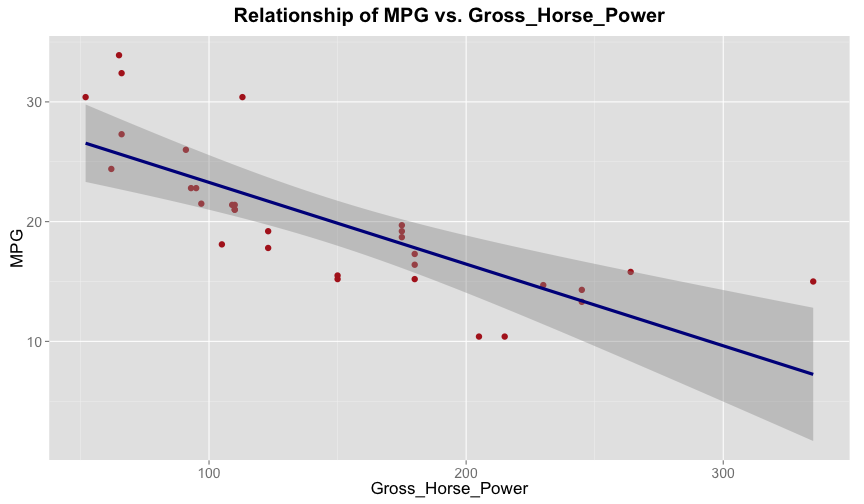

## About the project: "Motor Car MPG Explorer!"
 
- An web-based app (RShiny) that I created for the Coursera class: Developing Data Products.
- Data source: mtcars (from the built-in R datasets package).
  * More info: Extracted from the 1974 *Motor Trend* US magazine, and comprises fuel consumption and 10 aspects of automobile design and performance for 32 automobiles (1973-74 models).
- A brief glimpse of the dataset:  

```r
head(mtcars, 5)
```


|                  |  mpg| cyl| disp|  hp| drat|    wt|  qsec| vs| am| gear| carb|
|:-----------------|----:|---:|----:|---:|----:|-----:|-----:|--:|--:|----:|----:|
|Mazda RX4         | 21.0|   6|  160| 110| 3.90| 2.620| 16.46|  0|  1|    4|    4|
|Mazda RX4 Wag     | 21.0|   6|  160| 110| 3.90| 2.875| 17.02|  0|  1|    4|    4|
|Datsun 710        | 22.8|   4|  108|  93| 3.85| 2.320| 18.61|  1|  1|    4|    1|
|Hornet 4 Drive    | 21.4|   6|  258| 110| 3.08| 3.215| 19.44|  1|  0|    3|    1|
|Hornet Sportabout | 18.7|   8|  360| 175| 3.15| 3.440| 17.02|  0|  0|    3|    2|

---

## Goals of the project "Motor Car MPG Explorer!":

1. As the project name implies, this app allows one to explore the relationship between automobile performance (as indexed by MPG, "miles per gallon") and the 10 variables that measure automobile design, e.g. *"Number of Cylinders (CYL)", "Gross Horsepower (HP)"*, etc.  
2. Additionally, this app allows one to explore the relationships among a chosen (sub)set of the car transmission types.  
  * See more details @ "Features of the project" page.  

---

## Features of the project "Motor Car MPG Explorer!":

1. Via the **pull-down menu**, the user is able to interactively explore the relationship of MPG vs. any one of the 10 automobile design measures.  

2. Via the **checkbox**, the user is able to interactively explore the above relationships:  
  * Among all cars (default)  
  * Or, selectively only among cars with automatic transmission, or those with manual transmission  

3. Via the combination of **pull-down menu, checkbox, and sliderbar**, the user is able to interact with the aids for data pattern visualization.  Specifically:  
  - "Smoother" options include: None (default), loess, lm, glm, etc.  
  - Confidence interval around the "smoother": Include (default)/Exclude; When included, the level of confidence interval is also adjustable.  

---

Here's an example app output with the following setting:  
1. MPG vs. Gross_Horse_Power. 2. Include both transmission types. 3. Fit a linear model with confidence interval of 99%.

 
---  
